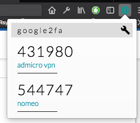

# Google authenticator addon firefox

addon 2 factor authentication for firefox

- Using jsOTP library: https://github.com/jiangts/JS-OTP
- To build this addon, you can use web-ext for folder src, ref: https://developer.mozilla.org/en-US/Add-ons/WebExtensions/Getting_started_with_web-ext
- To install plugin, select lastest version in folder dist. Firefox -> File -> Open

Demo image:

! thank you.

If you want to modify something to make it better, i'm very happy if you fork and give me a pull request xD!